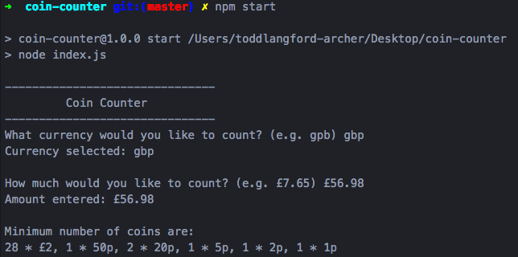
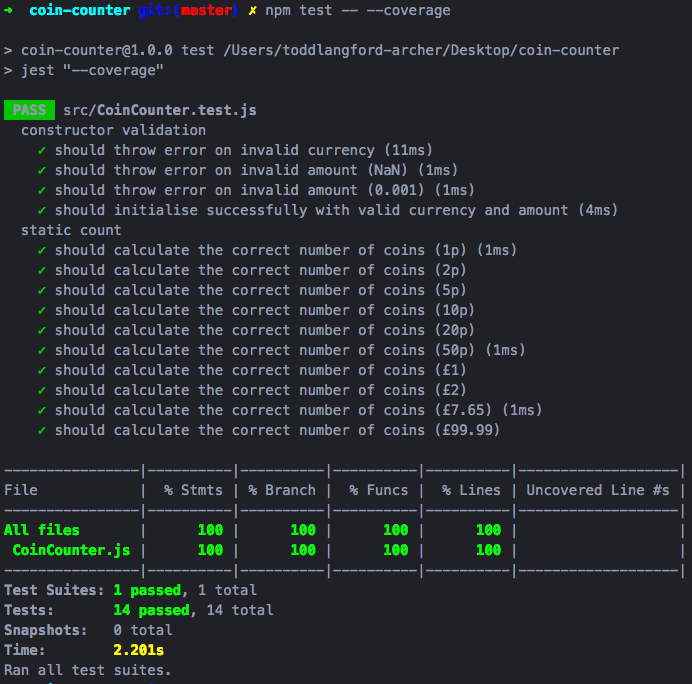

# Coin Counter

## Challenge
For any given value, what is the minimum UK coins you need to use to fulfil the total? For example, `£7.65` would be `3 * £2, 1 * £1, 1 * 50p, 1 * 10p, 1 * 5p.`
## Installation
clone the repo and install:
```sh
git clone https://github.com/toddpla/coin-counter.git
cd coin-counter
npm install
```

## Running the CLI
from the root directory:
```sh
npm start
```
The user will be asked to select the currency and then enter an amount.  
Please note currently the application has only one currency available; 'gbp'.  



## Testing
from the root directory:
```sh
npm test
```
or with coverage report:
```sh
npm test -- --coverage
```



## Development notes
- The logic of interest for this challenge can found in the CoinCounter.countCoins() (copied below).
I chose not to Google other solutions and went with this approach whereby iterating through the coins available in the currency selected and logging the count as number of times divisible with the remainder being passed to the next coin.  
This logic relies on the coins being listed in descending value order. To ensure this is correct a sort function could be added to ensure this is so. e.g. `.sort((a, b) => b.value = a.value)` I felt in the current situation this would be redundant code.
```js
countCoins() {
  let remainder = this._units;
  this._currencies[this._currency]
    .forEach(coin => {
      coin.count = Math.floor(remainder / coin.value);
      remainder = remainder % coin.value;
    });
}
```

- Other than devDependencies I aimed for the application to have no dependencies however chose to use Numeral-js as a tool to validate the amount input which considering the time constraint I thought reasonable.

- The brief mentioned using UK currency so the CoinCounter has been designed so that additional currencies can be integrated by adding them to the constructor function.

- I went slightly over the time limit as I decided to include a CLI as I was unsure whether this was a requirement.
